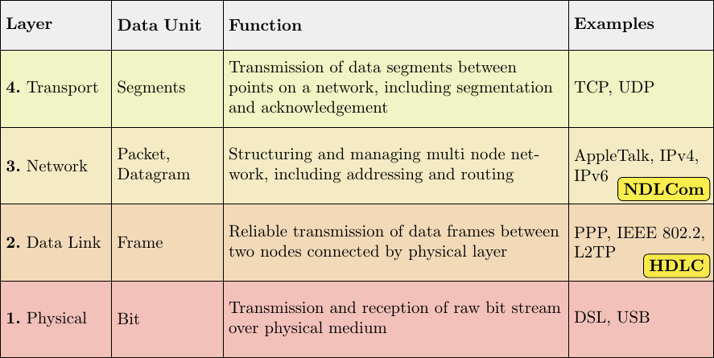
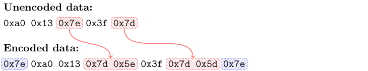
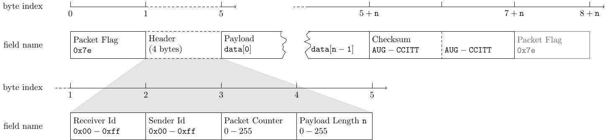

# Introduction

Complex heterogenuous systems are equipped with an increasing number of small decentralized computing devices. These are used to read sensors distributed across the system or for high-frequency control of motors. Connecting all these nodes in a packet based point-to-point network allows for flexible data transmission between all participants. NDLCom (Node Level Data Link Communication) defines a simple packet format for data exchange using serial interfaces, which needs fewer resources compared to traditional network technologies like IP. This allows microcontrollers or FPGAs with limited capabilities to communicate in a network with a PC. Point-to-point bytestream based on [UART][1] are viewed a smalled common denominator.

_todo: draw tikz-picture with multiple heterogeneous devices connected in a tree-like network_

The protocol provides a communication infrastructure simiar to the OSI-Layer 3, while it uses [HDLC][2] for Layer 2 message segmentation:

HDLC segments a continuous bytestream into individual messages by replacing every `0x7e` and `0x7d` with special escape-sequences (red) and sorounding each message with the previously replaced `0x7e` (blue), thereby marking the boundaries in a unique way. Of course, the decoder has to undo this.

The header of each packet consists of 4 byte: One byte for sender and receiver respectively allow for up to 254 different addresses plus the additional "broadcast" address. The third byte is a packet-counter to enable detection of lost packages. The payload with a maximum capacity of 255 bytes is following the specification of the packet length. At the end, each packet is guarded by a 16Bit [AUG-CCITT](doc/crc.md) checksum to detect transmission errors:

## History

Developed at DFKI in the iStruct and SeeGrip projects, beginning in 2010. To
obtain something more profound like presentations and papers see the
[documents](https://git.hb.dfki.de/istruct/documents/blob/master) repository.

The C "core" code is written with the embedded/bare-metal case in mind: There is
no dynamic memory involved, no C++, no locking and no multi threading. C++ code
is provided for POSIX systems to create actually usefull software.

## Structure

Comes with a cmake-based buildsystem and pkg-config files. Provides a simple Makefile acting as a cmake-wrapper, just call `make` and it will probably do the right thing. To generate doxygen-documentation call `make doc`, to install all files into the default-directory `~/DFKI.install` do `make install`.

- `src` Contains all source files of the library
- `test` Limited programs used for testing and benchmarking, called using `make test`
- `include/ndlcom` Contains all external headers used in the library.
- `doc` Some documentation, with `doc/tex` containing the tikz-sources for graphics
- `scripts` Some tooling and testing scripts which fit nowhere else
- `tools` Contains useful ready-made tools for actual usage, some are used in the folder `scripts`
- `build/...` The default target directory used during the build process, temporary content
- `DFKI.install` The default installation directory, set by the provided wrapper [Makefile](Makefile)

## Usage

There are two ways to use this project, both based on pkg-config:

1. Compile and install here at first, using the provided wrapper makefile. Then
   use pkg-config inside your other project to obtain the neccessary flags
   needed to use the files from the install-tree.
2. Use the cmake-directive `add_subdirectory` pointing to this CMakeLists in
   your main-cmake project. Then set the environment variable `PKG_CONFIG_PATH`
   to point to the build-directory and use pkg-config to obtain the flags to use
   the files from the build-tree. This relies on the *uninstalled* variant of
   pkg-config files.

## users

The "new" ndlcomBridge approach is used in the following C-based projects:

- Have a look into the [minimalExample](tools/minimalExample.cpp) of this repository
- [bgGraph templates](https://git.hb.dfki.de/esa_npi_2015/toolchain/blob/7c92f2ef/templates/bg_graph_toplvl_template.c#L60)
- PSoC based [microDMSBoard](https://git.hb.dfki.de/team2/microDMSBoard/blob/61ec03ac/common_src/comm.cpp#L94)
- [mdaq2](https://git.hb.dfki.de/istruct/stm32_mdaq2) via [lib_stm32common](https://git.hb.dfki.de/istruct/lib_stm32common/blob/a7d97f7f/src/usart.cpp#L72)
- DFKI Microcontrollerboards using [chibiOS](https://git.hb.dfki.de/team2/chibios_support/blob/2dca977c/comm.cpp#L160)
- [Treadmill](https://git.hb.dfki.de/hhanff/Treadmill)
- for the *ZynqBrain* board there exists a [kernel-module](https://git.hb.dfki.de/zynq-kernel-modules/driver-ndlcom) to map between data processed from the VHDL module into readable byte-streams on an user-space interface like `/dev/NDLCom`

[1]: https://en.wikipedia.org/wiki/Universal_asynchronous_receiver/transmitter
[2]: http://read.pudn.com/downloads138/sourcecode/others/589576/ISO13239.pdf
