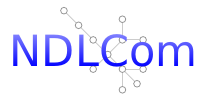
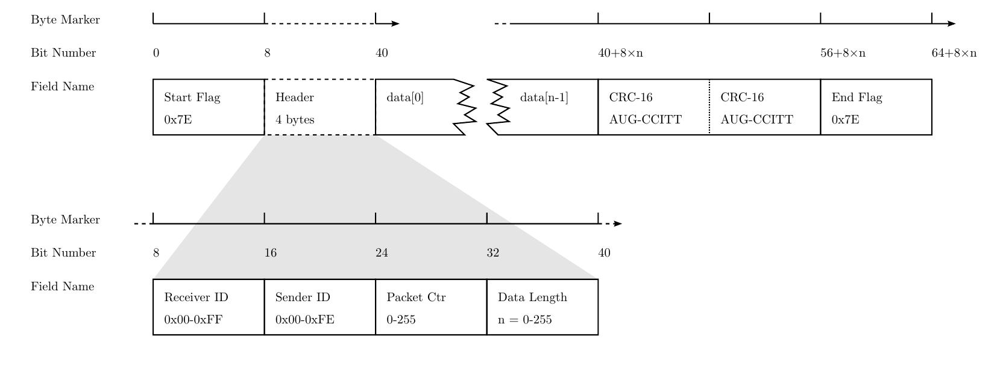
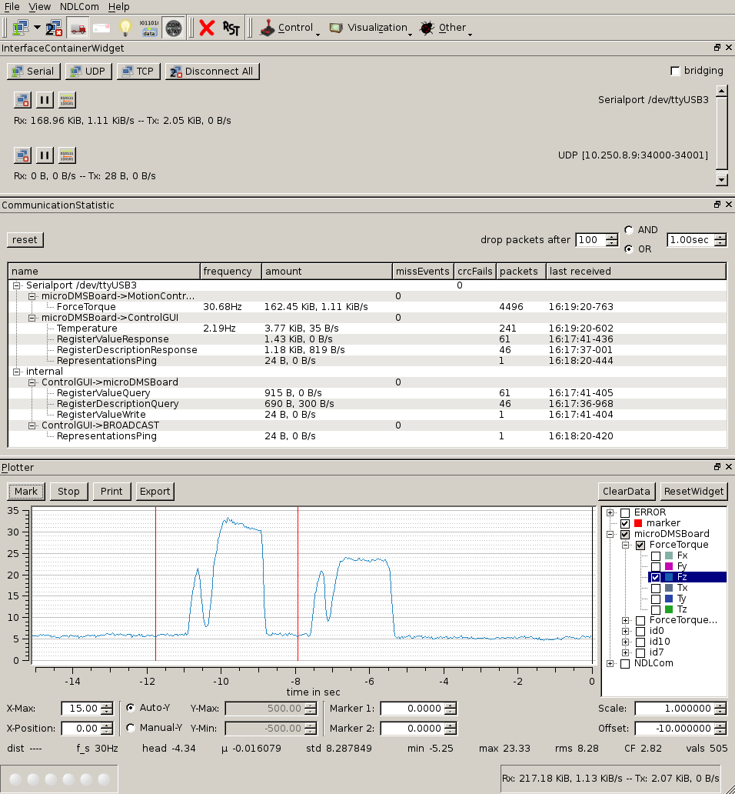

Modern robotic systems are equipped with an increasing number of small decentralized computing devices. These are for example used to read sensors distributed across the system or for high-frequency control of motors. Connecting all these nodes in a packet based point-to-point network allows for flexible data transmission between all participants. NDLCom (Node Level Data Link Communication) defines a simple packet format for data exchange using serial interfaces, which needs fewer resources compared to traditional network technologies like IP. This allows microcontrollers or FPGAs with limited capabilities to communicate in a network.

The protocol uses [HDLC](https://tools.ietf.org/html/rfc1662)-like frame marker to segment the serial data stream into packets. The header of each packet consists of 4 byte: One byte for sender and receiver respectively allow for up to 254 different addresses plus the additional "broadcast" address. The next byte is a packet-counter to enable detection of lost packages. The payload with a maximum capacity of 255 bytes is following the specification of the packet length. At the end, each packet is guarded by a 16Bit [checksum](crc.md) to detect transmission errors. It is not supported to restore lost or damages packages, and each participant in the network has to be reachable by a unique path, circles are not permitted.

A graphical user interface written in Qt4 allows connection of a regular Linux computer to a NDLCom network. The software is able to create multiple connections in parallel via USB, TCP and UDP. Different components exist to receive and send packets, analyze the data over time, and store the data stream in a binary or CSV format for later usage. Different specialized widgets are present to provide interfaces for additiONal properties of devices. There are implementations of NDLCom for C/C++ and VHDL, applied to architectures like Spartan3/6, STM32 and AVR.

